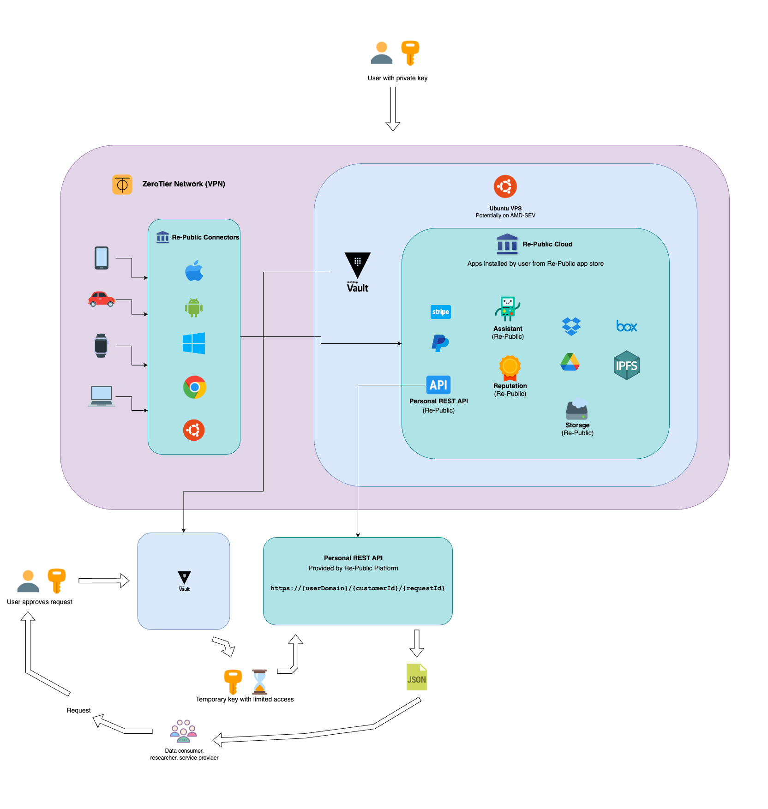
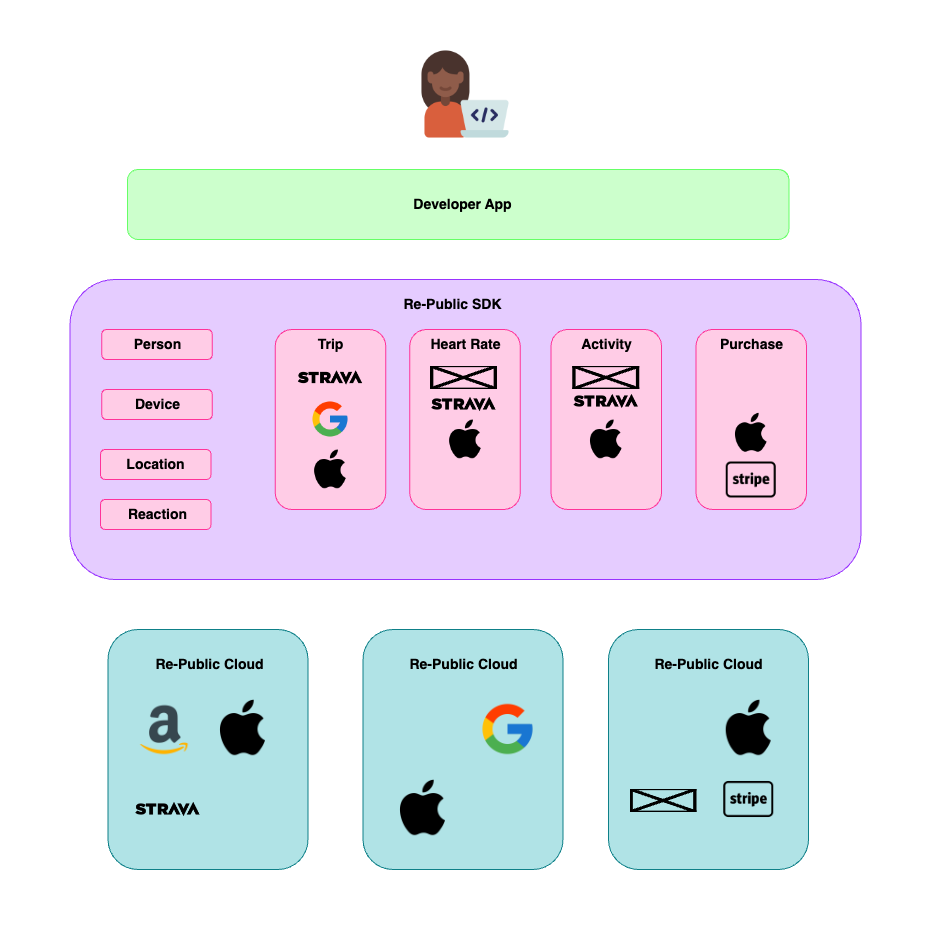

# Re-Public

> We're looking for builders who want to enable people to host, control, and leverage their data for themselves. No more 
> data silos on servers. Each person is their own data silo and your app runs inside their secure environment. 
> Contact: `devs@re-public.io`

[White Paper](https://boom-riverbed-8de.notion.site/The-Re-Public-White-Paper-988fad1699dc4c10a1342fa148120066) | 
[re-public.io](https://re-public.io) | [Blog](https://re-public.io/blog) | [Twitter](https://twitter.com/republicdao)

Every person on the planet generates data that’s valuable to humanity. We all have a piece of the human puzzle which is 
currently impossible to assemble or reason about. From our genomes, to our decisions, to our relationships, to our daily 
activities … We are generating a value far greater than can currently be seen or manifested through software, consumer 
products, census data, or scientific studies.

To change this, and to profoundly reduce inequality around the world, Re-Public wants to give every person who wants one
a private cloud computing environment. While the software itself is free to use, permissionless, and auditable, its 
purpose is to create a completely private digital environment for the individual. In using the software, the individual
bears no ongoing relationship to Re-Public as an entity. It's just software.

It includes private clouds, private networks, and decentralized coordination systems, which together eliminate all 
intermediaries between a person and their data while preserving and vastly extending the functionality people expect 
from the internet today. We share a vision similar to DWeb, P2P Networks, and the IndieWeb.

We are acutely aware of many smart people in the space building [awesome projects](awesome-projects.md) in service of similar goals. At every 
opportunity we will be integrating with and contributing to these projects.

- [What is Re-Public?](#what-is-re-public)
  - [Re-Public Cloud](#re-public-cloud)
    - [Data Sharing](#data-sharing)
  - [Re-Public SDK](#re-public-sdk)
  - [Re-Public Network and Marketplace](#re-public-network-and-marketplace)
- [Where to find the software](#where-to-find-the-software)
  - [re-public-os-server](https://github.com/Re-Public-DAO/re-public-os-server)
  - [re-public-os-web](https://github.com/Re-Public-DAO/re-public-os-web)
- [Contributing Guidelines](#contributing-guidelines)
  - [Code of Conduct](#code-of-conduct)
  - [Getting Started](#getting-started)
    - [Issues](#issues)
    - [Pull Requests](#pull-requests)
    - [Commit Messages](#commit-messages)

## What is Re-Public?

The overall purpose of the Re-Public stack is to glue together existing tools and build the last mile of UX for 
non-technical people into an experience and service that is greater than its parts.

For the builders behind the scenes, however, we must get into the technical details.

### Re-Public Cloud

Below is a diagram outlining a high-level view of the Re-Public Cloud. 



The main idea here is to wrap the user's software in a VPN that only they can access. This simplifies authentication 
and security methods for inter-device communication. It also gives users and developers the many benefits that come 
with a VPN, both now and in the future.

The native apps that run on each of the user's devices belong to the VPN and securely transmit all data generated from 
the device to the Cloud.

Within the secure Cloud enclave is where developers' apps are installed and run. When they run, they must ask for 
permissions to access any of the data they require -- similar to other OS's today.

The apps are **private by default** and the user must approve all external requests for data. That means no telemetry, no 
phoning home ... the developer potentially has no idea how many times their app has been installed or how often it's 
used.

#### Data Sharing

One of the apps that is native to the Cloud is the Personal API. This app allows users to spin up JSON endpoints with 
tightly scoped permissions. These endpoints are accessed with revocable keys that the Cloud owner can shutdown at any 
time.

In the future these endpoints can be generated and discarded automatically based on user preferences. The Personal API
is the first experimental implementation. We expect the mechanics behind this functionality to evolve drastically over 
time.

### Re-Public SDK

Developers use the SDK to develop their apps that run inside the Re-Public Cloud.



Rather than coding against particular APIs and handling OAuth flows, developers code against the schemas for common 
concepts surfaced by the SDK like `Person`, `Location`, `Heart Rate`, `Listen`, etc.

These schemas are hydrated by data that can potentially come from any source or device. Instead of developers having to
integrate specific APIs, they can focus on the experience they're trying to build and the schemas that they need.

For example, a developer may want to create a map interface that shows where a user took a `Run`. The `Run` 
might contain a `Location` list that can be shown on the map. But those `Location` objects may also point to a
`Listen`, and a `Heart Rate`, allowing the developer to show the user a rich visualization that's dense with 
cross-referencing data. All without having to worry about or know the Strava API, the Spotify API, or the Apple Health
API. No authentication flows, no rate limiting, no API changes, no data ownership issues, no data silos.


### Re-Public Network and Marketplace

The Marketplace is the decentralized mediator or value exchange. When Cloud owners **opt-in** to data sharing, the
Marketplace makes sure that their data is surfaced only when requests are made that fit with their consent profile.

When a data order is initiated, the Marketplace queries the Network. The Network then goes to each Cloud that has opted
in to data sharing and asks if they have data that fits the request. A minimal amount of aggregate metadata is returned
to the Marketplace to tell the Data Consumer if the request can be fulfilled and how much it will cost.

If the Data Consumer accepts the terms, the Marketplace sends the request to the Network. The Network then goes to each
Cloud that can fulfill the request and collects the data into a secure enclave. After the enclave contains all the data
in the order, it processes the data into a format that the Data Consumer requested.

After receipt of the data output is confirmed by the Data Consumer, the enclave is destroyed and the Clouds receive
whatever distribution of value they stipulated in their terms, if any.

The Network is also used to facilitate the exchange of value between Clouds. For example, if a Cloud owner wants to
share their data with another Cloud owner, they can do so by initiating a request through the Network. The Network
then facilitates the exchange of value, or settlement of terms, between the two Clouds.

In this way a Cloud owner's data may appear in the app of another Cloud owner after consenting to share it, but access
to that shared data is removed at any point that the sharer revokes access.


# Where to find the software

Re-Public is spread across many different repos since each one may have its own team and community.

- [re-public-os-server](https://github.com/Re-Public-DAO/re-public-os-server)
- [re-public-os-web](https://github.com/Re-Public-DAO/re-public-os-web)


# Contributing Guidelines

Thank you for considering contributing to this project! We value your time and effort and aim to make the contribution 
process straightforward, respectful, and inclusive.

## Code of Conduct
By participating in this project, you're expected to uphold our Code of Conduct:

**Empathy**: Always try to see things from the perspective of others. Understand differences, ask questions, and be 
patient.

**Civility**: Address issues and pull requests professionally. Avoid demeaning, discriminatory, or harassing behavior 
and speech.

**Kindness**: Be kind to others. Constructive criticism is welcome, but criticize ideas, not people.

## Getting Started

### Issues

Before submitting a new issue, check to ensure the issue hasn't been already reported.

Provide as much context as you can. The more details, the easier it'll be for us to understand and solve the problem.

### Pull Requests
Fork the repository and create a new branch for your feature or fix.

Make sure to add tests (if applicable) and update the documentation with your changes.

Write a clear log message for your commits. One-line messages are fine for small changes, but bigger changes should look like this:

```csharp
[Short summary of change]
[Empty line]
[Longer explanation]
```

### Commit Messages

Begin the commit message with a single short sentence summarizing the change. No period at the end.

Depending on the complexity, continue with a more detailed description below. Use markdown formatting when necessary.

## Open Source License

Remember, contributions to this repository will be licensed under its MIT License.

## Need Help?

If you're unsure about anything or need help with the contributing process, don't hesitate to ask. We're here to help!

